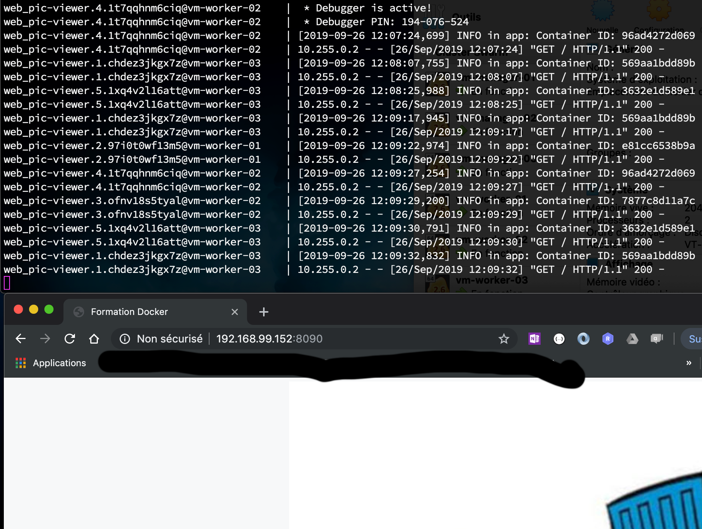

# Travaux pratiques (TP)

## Commandes utiles

### Suppression des conteneurs (containers) Docker

#### Supprimer tous les conteneurs 

```sh
docker stop $(docker ps -a -q)
docker rm $(docker ps -a -q)
```

#### Supprimer seulement les conteneurs 'Exited'

docker rm $(docker ps -a | grep 'Exited' | awk '{print $1}')

### Supprimer toutes les images Docker

```sh
docker rmi $(docker ls -q)
docker rmi $(docker images -f 'dangling=true' -q)
```

### Supprimer seulement les images `none`

```sh
docker rmi $(docker image ls -a | grep '<none>' | awk '{print $3}')
docker rmi $(docker images -f 'dangling=true' -q)
```

### Conseils

Voici quelques conseils à prendre en compte avant de vous lancer dans la réalisation des TP ci-après.

- [x] Pensez à créer un sous répertoire pour stocker vos fichiers pour chaque TP. 
- [ ] Munissez-vous d'un éditeur qui reconnait la syntaxe Dockerfile. 


## TP 1 : Hello World

**Objectifs :** 
 - Créer une image docker en se basant sur l'image officielle `hello-world` existante. 
 - Faire un test d'exécution avec la commande `docker run ...`.
 - Pousser l'image dans le dépôt de Docker Hub.

**Prérquis :**
- [x] Avoir un compte [Docker Hub](https://hub.docker.com)
- [x] Connaître les commandes basiques de Docker
- [x] Connaître les instructions basiques d'écriture d'un Dockerfile


Commencez par créer le fichier [Dockerfile](hello-world/Dockerfile) :
 
<details open>
  <summary>Dockerfile</summary>


```Dockerfile
FROM hello-world
LABEL maintainer="..."
```

</details>

Utilisez la commande ci-dessous pour construire votre image : 

```sh
docker build --rm --tag <votre-id-docker-hub>/hello-world .
```

Faites un test d'exécution :

```sh
docker run <votre-id-docker-hub>/hello-world
```

Si tout se passe bien (il n'y a aucune raison que cela se passe mal ;)), poussez votre image un sur votre dépôt `Docker Hub` :

```sh
docker login

docker push <votre-id-docker-hub>/hello-world
```

## TP 2 : Pinger

**Objectifs :** 


**Prérquis :**

<details open>
  <summary>Dockerfile</summary>

```Dockerfile
FROM alpine
LABEL maintainer="..."
ARG SERVER_IP
ENV SERVER ${SERVER_IP:-localhost}
CMD ping $SERVER
```

</details>

1. Pour construire l'image Docker

```sh
docker build --rm=true --build-arg SERVER=localhost --tag <votre id docker hub>/pinger .
```

2. Pour exécuter l'application

```sh
docker run --name pinger -e SERVER=192.168.xxx.xxx <votre id docker hub>/pinger
```

3. Pour pusher l'image sur le repos Docker Hub

```sh
docker push <votre id docker hub>/pinger
```

## TP 3 : Exposition des ports

**Objectifs :** 


**Prérquis :**

```sh
docker run --name hello-world -p 8080:5000 -d ntdtfr/hello-world
```

## TP 4 : Volume et persistance des données

**Objectifs :** 


**Prérquis :**

```sh
docker run --name pic1 -p 8081:5000 -v /Users/ntran/Datas/pictures:/pic-viewer/static -d ntdtfr/pic-viewer
```

## TP 5 : Composition des services avec `docker-compose`

**Objectifs :** 


**Prérquis :**


<details open>
  <summary>docker-compose.yml</summary>

```yaml
version: "3"
services:
  pic-viewer:
    image: ntdtfr/pic-viewer
    restart: always
    ports:
      - 8090:5000
    volumes:
      - /Users/ntran/Datas/pictures:/pic-viewer/static
```

</detail>

## TP 6 : Docker Machine

**Objectifs** : Créez une machine virtuelle (VM) avec `docker-machine` pour hégerber l'application `pic-viewer`. Nommez cette VM `vm-web-server`.
`

### **Etape 1**: Commencez par créer la VM `vm-web-server`

#### Pour MacOS / Linux (Virtualbox)

```sh
docker-machine create --driver=virtualbox vm-web-server
```

#### Pour Windows (Hyper-V)

Créez d'abord un commutateur virtuel (virtual switch) depuis le Gestionnaire Hyper-V. Nommez le commutateur `form-docker` et sélectionnez `Réseau externe` comme type de connexion :


Une fois que le commutateur créé, ouvrez un terminal Powershell en mode administrateur et exécutez la commande ci-dessous :

```sh
docker-machine create --driver hyperv --hyperv-virtual-switch form-docker vm-web-server
```

Vous pouvez réduire la taille du disque virtuel en ajoutant cette option `--hyperv-disk-size 2048` à votre ligne de commande.

```sh
docker-machine create --driver hyperv --hyperv-virtual-switch form-docker --hyperv-disk-size 2048 vm-web-server
```

### **Etape 2**: Déployer l'application `pic-viewer` sans mapping de volumes

#### Pour MacOS / Linux

```sh
eval $(docker-machine env vm-web-server)
```


Déployez l'application `pic-viewer` :

```sh
docker run -d -p 8080:5000 --restart=always ntdtfr/pic-viewer
```

#### Pour Windows

Exécutez cette commande depuis un Powershell en mode `administrateur`

```sh
docker-machine env vm-web-server | Invoke-Expression
```


Déployez l'application `pic-viewer` :

```sh
docker run -d -p 8080:5000 --restart=always ntdtfr/pic-viewer
```

### Reset des variables d'environnement

```sh
eval $(docker-machine env -u)
```

## TP 7 : Swarm

**Objectifs :** 


**Prérquis :**


### Create the cluster VMs

```sh
master_ip=`docker-machine ip vm-web-server`
docker swarm init --advertise-addr $master_ip
```

* List all cluster VM:

```
docker-machine ls
```

```
NAME            ACTIVE   DRIVER       STATE     URL                         SWARM   DOCKER     ERRORS
vm-manager-01   -        virtualbox   Running   tcp://192.168.99.152:2376           v19.03.1   
vm-manager-02   -        virtualbox   Running   tcp://192.168.99.153:2376           v19.03.1   
vm-manager-03   -        virtualbox   Running   tcp://192.168.99.154:2376           v19.03.1   
vm-worker-01    -        virtualbox   Running   tcp://192.168.99.155:2376           v19.03.1   
vm-worker-02    -        virtualbox   Running   tcp://192.168.99.156:2376           v19.03.1   
vm-worker-03    -        virtualbox   Running   tcp://192.168.99.157:2376           v19.03.1 
```

### Initialisation du cluster Swarm

```
Swarm initialized: current node (nm7prjsmmkev04h1jkq0asdv4) is now a manager.

To add a worker to this swarm, run the following command:

    docker swarm join --token SWMTKN-1-07dax26x6l3odl7xniex5taq0fke1noy7i5mqgvv54xje8yk35-2dmxak6hf6zm7w6ha3bsknf0f 192.168.99.148:2377

To add a manager to this swarm, run 'docker swarm join-token manager' and follow the instructions.
```


* List all cluster nodes :

```
eval $(docker-machine env vm-manager-01)
docker node ls
```

```
ID                            HOSTNAME            STATUS              AVAILABILITY        MANAGER STATUS      ENGINE VERSION
i6skoqovg4j52ghs5k30cbkct *   vm-manager-01       Ready               Active              Reachable           19.03.1
ql2g8bs5aq73tr8rkkmerpk85     vm-manager-02       Ready               Active              Leader              19.03.1
xqwichf48u12x6949dt8b19i2     vm-manager-03       Ready               Active              Reachable           19.03.1
0zqid316x0g6bltm29wbt87xx     vm-worker-01        Ready               Active                                  19.03.1
9fp48bv9imj1wv7y05ciaykx4     vm-worker-02        Ready               Active                                  19.03.1
urrvjyekoq5yst7bbgplgxi8y     vm-worker-03        Ready               Active                                  19.03.1
```

### Déploiement des services

* pic-viewer-stack-replicas.yaml

<details open>
  <summary>pic-viewer-stack-replicas.yaml</summary>

```yaml
version: "3"
services:
  pic-viewer:
    image: ntdtfr/pic-viewer
    ports:
    - 8090:5000
    deploy:
      mode: replicated
      replicas: 2
      restart_policy:
        condition: on-failure
      placement:
        constraints: [node.role == worker]
```

</details>

```sh
docker stack deploy --compose-file pic-viewer-stack-replicas.yaml web
```

### Vérification des services déployés

```sh
docker service ls
```

```
ID                  NAME                MODE                REPLICAS            IMAGE                      PORTS
mfysi1tzwfgz        web_pic-viewer      replicated          2/2                 ntdtfr/pic-viewer:latest   *:8090->5000/tcp
```

### Scale des services

```
docker service scale web_pic-viewer=5
```

```
web_pic-viewer scaled to 5
overall progress: 5 out of 5 tasks
1/5: running   [==================================================>]
2/5: running   [==================================================>]
3/5: running   [==================================================>]
4/5: running   [==================================================>]
5/5: running   [==================================================>]
verify: Service converged
```


### Tests load balancing

```sh
docker service logs -f web_pic-viewer
```

```
web_pic-viewer.5.1xq4v2l16att@vm-worker-03    |  * Serving Flask app "app.py" (lazy loading)
web_pic-viewer.5.1xq4v2l16att@vm-worker-03    |  * Environment: development
web_pic-viewer.5.1xq4v2l16att@vm-worker-03    |  * Debug mode: on
web_pic-viewer.5.1xq4v2l16att@vm-worker-03    |  * Running on http://0.0.0.0:5000/ (Press CTRL+C to quit)
web_pic-viewer.5.1xq4v2l16att@vm-worker-03    |  * Restarting with stat
web_pic-viewer.5.1xq4v2l16att@vm-worker-03    |  * Debugger is active!
web_pic-viewer.5.1xq4v2l16att@vm-worker-03    |  * Debugger PIN: 322-074-200
web_pic-viewer.2.97i0t0wf13m5@vm-worker-01    |  * Serving Flask app "app.py" (lazy loading)
web_pic-viewer.2.97i0t0wf13m5@vm-worker-01    |  * Environment: development
web_pic-viewer.2.97i0t0wf13m5@vm-worker-01    |  * Debug mode: on
web_pic-viewer.2.97i0t0wf13m5@vm-worker-01    |  * Running on http://0.0.0.0:5000/ (Press CTRL+C to quit)
web_pic-viewer.2.97i0t0wf13m5@vm-worker-01    |  * Restarting with stat
web_pic-viewer.2.97i0t0wf13m5@vm-worker-01    |  * Debugger is active!
web_pic-viewer.2.97i0t0wf13m5@vm-worker-01    |  * Debugger PIN: 147-357-853
web_pic-viewer.3.ofnv18s5tyal@vm-worker-02    |  * Serving Flask app "app.py" (lazy loading)
web_pic-viewer.3.ofnv18s5tyal@vm-worker-02    |  * Environment: development
...
```

